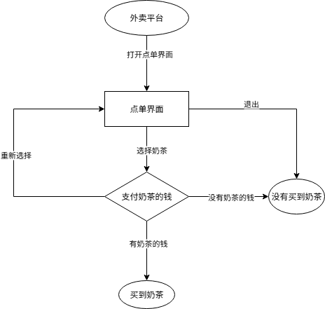
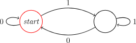
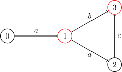

# 数据结构与算法A

***2025年秋季大二上***

---

## 目录

1. [栈和队列](#栈和队列)
    1. [后缀表达式](#中缀表达式转后缀表达式)
2. [图灵机](#图灵机)
3. [字符串](#字符串)
    1. [计算理论基础](#计算理论基础)
    2. [有限状态自动机(FSM)](#有限状态自动机)
    3. [KMP算法](#KMP算法)

---

## 栈和队列

---

### 中缀表达式转后缀表达式

[原题链接(POJ)](http://dsa.openjudge.cn/2025dsachapter3/C/)

***题目描述***
人们熟悉的四则运算表达式称为中缀表达式，例如(23+34*45/(5+6+7))。在程序设计语言中，可以利用堆栈的方法把中缀表达式转换成保值的后缀表达式（又称逆波兰表示法），并最终变为计算机可以直接执行的指令，得到表达式的值。

给定一个中缀表达式，编写程序，利用堆栈的方法，计算表达式的值。

**输入**
第一行为测试数据的组数N
接下来的N行，每行是一个中缀表达式。表达式中只含数字、四则运算符和圆括号，操作数都是正整数，数和运算符、括号之间没有空格。中缀表达式的字符串长度不超过600。

**输出**
对每一组测试数据输出一行，为表达式的值

**样例输入**

    3
    3+5*8
    (3+5)*8
    (23+34*45/(5+6+7))

**样例输出**

    43
    64
    108

**提示**

注意：运算过程均为整数运算（除法运算'/'即按照C++定义的int除以int的结果，测试数据不会出现除数为0的情况），输出结果也为整数（可能为负）。
中间计算结果可能为负。

1. cpp版本

```c++ {.line-numbers}
#include <iostream>
#include <string>
#include <stack>
#include <vector>
using namespace std;

struct node {
    int type;
    union {
        int data;
        char op;
    };
    node(int x) : type(0) {data = x;}
    node(char x) : type(1) {op = x;}
}; //这里使用type标记是data还是op，并使用了union语法

inline int priority(char x) {
    if (x == '+' || x == '-') return 0;
    else if (x == '*' || x == '/') return 1;
    else return -1;
} //计算优先级

int cal(int x, int y, char op) {
    if (op == '+') return x + y;
    else if (op == '-') return x - y;
    else if (op == '*') return x * y;
    else if (op == '/') return x / y;
} //对栈中元素进行操作

int main()
{
    int n;
    cin >> n;
    while(n--) {
        string input;
        cin >> input;
        vector<node> back_expression;
        int i = 0, len = input.size();
        stack<char> op;
        while(i < len) {
            if (isdigit(input[i])) {
                int temp = 0;
                while(i < len && isdigit(input[i])) {
                    temp = temp * 10 + (input[i] - '0');
                    i++;
                }
                back_expression.push_back(node(temp));
            } //读入num
            else if (input[i] == '(') {
                op.push(input[i]);
                i++;
            }
            else if (input[i] == ')') {
                while(op.top() != '(') {
                    back_expression.push_back(node(op.top()));
                    op.pop();
                }
                op.pop();
                i++;
            }
            else {
                while(!op.empty() && priority(op.top()) >= priority(input[i])) {
                    back_expression.push_back(node(op.top()));
                    op.pop();
                }
                op.push(input[i]);
                i++;
            }
        }
        while(!op.empty()) {
            back_expression.push_back(op.top());
            op.pop();
        }

        stack<int> result;
        for(auto item : back_expression) {
            if (item.type == 0) {
                result.push(item.data);
            }
            else if (item.type == 1) {
                int y = result.top();
                result.pop();
                int x = result.top();
                result.pop();
                result.push(cal(x, y, item.op));
            }
        } //计算后缀表达式
        cout << result.top() << endl;
    }
    return 0;
}
```

2. C版本

```c {.line-numbers}
#include <stdio.h>
#include <string.h>

int n, top;
char s[710], st[710];
char s1[710];

int main() {
    scanf("%d", &n);
    while (n--) {
        scanf("%s", s);
        int len = strlen(s);
        top = 0;
        for (int i = 0; i < len; i++) {
            switch (s[i]) {
                case '+': 
                case '-': {
                    while (top && st[top] != '(') printf("%c ", st[top--]);
                    st[++top] = s[i];
                    break;
                }
                case '*':
                case '/': {
                    while (!(!top || st[top] == '(' || st[top] == '-' || st[top] == '+')) printf("%c ", st[top--]);
                    st[++top] = s[i];
                    break;
                }
                case '(': {
                    st[++top] = s[i];
                    break;
                }
                case ')': {
                    while (st[top] != '(') printf("%c ", st[top--]);
                    top--;
                    break;
                }
                default: {
                    int cnt = 0;
                    while (i < len && ((s[i] >= '0' && s[i] <= '9') || s[i] == '.')) s1[cnt++] = s[i++];
                    i--;
                    s1[cnt] = '\0';
                    printf("%s ", s1);
                }
            }
        }
        while (top) printf("%c ", st[top--]);
        printf("\n");
    }
    return 0;
}
```

---

## 图灵机

### 确定性图灵机

不加说明时，「图灵机」往往指「确定性图灵机」，本文中也是如此。

图灵机有很多不同的定义，这里选取其中一种，其它定义下的图灵机往往与下面这种定义的图灵机计算能力等价。

图灵机是一个在一条可双向无限延伸且被划分为若干格子的纸带上进行操作的机器，其有内部状态，还有一个可以在纸带上进行修改与移动的磁针。

正式地说，图灵机是一个七元组 $M=\langle Q,\Gamma,b,\Sigma,\delta,q_0,F\rangle$，其中：

- $Q$ 是一个有限非空的 **状态集合**；
- $\Gamma$ 是一个有限非空的 **磁带字母表**；
- $b\in\Gamma$ 是 **空字符**，它是唯一一个在计算过程中可以在磁带上无限频繁地出现的字符；
- $\Sigma\subseteq(\Gamma\setminus\{b\})$ 是 **输入符号集**，是可以出现在初始磁带（即输入）上的字符；
- $q_0\in Q$ 是 **初始状态**；
- $F\subseteq Q$ 是 **接受状态**，如果一个图灵机在某个接受状态停机，则称初始磁带上的内容被这个图灵机 **接受**。
- $\delta :(Q\setminus F)\times \Gamma \not \to Q\times \Gamma \times \{L,R\}$ 是一个被称作 **转移函数** 的 partial function（即只对定义域的一个子集有定义的函数）。如果 $\delta$ 在当前状态下没有定义，则图灵机停机。

图灵机从初始状态与纸带起点起，每次根据当前的内部状态 $x$ 和当前磁针指向的纸带上的单元格中的字符 $y$ 进行操作：若 $\delta(x, y)$ 没有定义则停机，否则若 $\delta(x, y)=(a, b, c)$，则将内部状态修改为 $a$，将磁针指向的格子中的字符修改为 $b$，若 $c$ 为 $L$ 则向左移动一格，为 $R$ 则向右移动一格。

其实，知道图灵机的工作细节是不必要的，只需建立直观理解即可。

图灵机 $M$ 在输入 $x$ 下的输出记作 $M(x)$（$M(x)=1$ 当且仅当 $M$ 接受 $x$，$M(x)=0$ 当且仅当 $M$ 在输入 $x$ 下在有限步骤内停机且 $M$ 不接受 $x$），也可以在括号内包含多个参数，用逗号隔开，具体实现时可以向字母表中添加一个元素表示逗号来隔开各个参数。

图灵机与冯·诺依曼计算机解决问题的时间复杂度差别在多项式级别内，所以研究复杂度类时可以使用图灵机作为计算模型。

### 非确定性图灵机

非确定型图灵机是图灵机的一种，它与确定型图灵机的不同在于：确定型图灵机的每一步只能转移到一个状态，而非确定型图灵机可以「同时」转移到多个状态，从而在多个「分支」并行计算，一旦这些「分支」中有一个在接受状态停机，则此非确定性图灵机接受这个输入。

事实上，任何确定型图灵机都可以用类似于迭代加深搜索的方式在指数级时间内模拟一台非确定型图灵机多项式时间内的行为。

在现实生活中，确定型图灵机相当于单核处理器，只支持串行处理；而非确定型图灵机相当于理想的多核处理器，支持无限大小的并行处理。

### 图灵机的编码

图灵机可以被自然数编码，即存在满射函数 $f:\mathbb{N}\to\mathbb{M}$，使得每个自然数都对应一个图灵机，而每个图灵机都有无数个编码。因此，由若干图灵机构成的集合可以是一个语言。

记由自然数 $\alpha$ 编码的图灵机为 $M_{\alpha}$ 。

### 通用图灵机

存在一台图灵机 $\mathcal U$ 满足：

1. 若 $M_{\alpha}$ 在输入 $x$ 下在有限时间内停机，则 $\mathcal{U}(x, \alpha)=M_{\alpha}(x)$，否则 $\mathcal{U}(x, \alpha)$ 不会在有限时间内停机；
2. 如果对于任意 $x\in\{0, 1\}^\ast$，$M_\alpha$ 在输入 $x$ 下在 $T(|x|)$ 时间内停机，则对于任意 $x\in\{0, 1\}^\ast$，$\mathcal{U}(x, \alpha)$ 在 $O(T(|x|)\log T(|x|))$ 时间内停机。

即：存在一台通用图灵机，它能模拟任何一台图灵机，且花费的时间只会比这台被模拟的图灵机慢其运行时间的对数。

---

## 字符串

---

### 计算理论基础

***——选自oi-wiki***

### 问题

#### 语言

一个 **字母表（alphabet）** 是一个非空有限集合，该集合中的元素称为**符号/字符（symbol）**。

令 $\Sigma^\ast$ 表示非负整数个 $\Sigma$ 中的字符连接而成的串，字母表  $\Sigma$ 上的一个 **语言（language）** 是 $\Sigma^\ast$ 的一个子集。

需要注意的是，这里的「语言」是一个抽象的概念，通常意义上的字符串是语言，所有的有向无环图也可以是一个语言（01 串与有向图之间可以建立双射，具体方式无需了解）。

由于任何语言都可以转化成 01 串的形式，所以在下文中不加说明时 $\Sigma=\{0, 1\}$。

#### 判定问题

判定问题就是只能用 YES/NO 回答的问题，本质上是判定一个串是否属于一个语言，即：$f:\Sigma^\ast\rightarrow\{0, 1\}, f(x)=1\iff x\in L $ 是一个关于字母表 $\Sigma$ 和语言 $L$ 的判定问题。如，「判定一张图是不是一个有向无环图」就是一个判定问题。

#### 功能性问题

功能性问题的回答不止 YES/NO，可以是一个数或是其它。如，「求两个数的和」就是一个功能性问题。

任何功能性问题都可以转化为一个判定问题，如，「求两个数的和」可以转化为「判定两个数的和是否等于第三个数」。

判定问题也可以转化为一个功能性问题：求这个判定问题的指示函数，即上文中判定问题定义里的 $f$。

---

### 有限状态自动机

[前置知识：语言和判定问题](#计算理论基础)

[参考链接:oi-wiki](https://oi-wiki.org/misc/fsm/, "oi-wiki.org")

**有限状态自动机**（Finite State Machine，FSM，以下也简称自动机）是最简单的一类计算模型，体现在它的描述能力与资源都极其有限。自动机广泛应用在 OI、计算机科学中，其思想在许多字符串算法中都有涉及，因此推荐在学习一些字符串算法（KMP、AC 自动机、SAM）前先完成自动机的学习。

#### 自动机入门

首先，我们来理解自动机是用来做什么的：自动机是一种判断一个信号序列是否满足某种特定模式或规则的数学模型。

这句话中的一些术语可以具体解释一下。「信号序列」指的是一个按顺序排列的信号，例如字符串从前到后的每一个字符、数组从 $1$ 到 $n$ 的每一个数、数从高到低的每一位等。「判断是否满足某种规则」，可以理解为：我们关心这个序列是否属于某个特定的集合。这个集合由我们事先设定好的规则来定义，例如「所有长度为偶数的二进制串」或「所有回文串」。

有时我们需要回答这类问题：一个给定的序列，是否满足某种特性？例如，一个二进制数是否是奇数，一个字符串是否是回文，或是否是另一个字符串的子序列等等。自动机就是用来解决这类问题的数学工具。

自动机的工作原理和流程图很类似。假设你想要在外卖平台点购一杯奶茶，你的所有选择就构成了一个序列。以下这个流程图是一个例子：



例如，你的选择序列是「打开点单界面 -> 选择奶茶 -> 有奶茶的钱」，那你按顺序经过的状态可能是「外卖平台 -> 点单界面 -> 支付奶茶的钱 -> 买到奶茶」。就这样，我们的这个「奶茶自动机」根据我们的选择，帮我们判定了我们是否买到了奶茶。我们还可以发现，到达一个状态的方法可能不止一条。同样没有买到奶茶，你可能是在点单界面直接退出，或者没有奶茶的钱以至于没有买到奶茶。

我们通过这个自动机，将信号序列分成了两类：一类是买到了奶茶的信号序列，一类是没有买到奶茶的信号序列。根据最后位于的状态的不同，我们就完成了一个判定问题。

虽然我们刚才用流程图来类比自动机的工作过程，但流程图本身只是一个直观的可视化工具，并不构成对自动机的数学定义。为了更准确地刻画自动机的结构，我们需要对流程图中的元素进行抽象。抽象之后，我们发现流程图的结构其实可以简化为一个有向图，其中每个结点表示一种状态，每条有向边表示状态之间的转换。

因此，自动机的核心结构可以形式化地看作是一张有向图，我们称之为 **状态图**。

自动机的工作方式和流程图类似，不同的是：自动机的每一个结点都是一个判定结点；自动机的结点只是一个单纯的状态而非任务；自动机的边可以接受多种字符（不局限于`T`或`F`）。

举个例子，完成「判断一个二进制数是不是偶数」的自动机如下：



从起始结点开始，从高到低接受这个数的二进制序列，然后看最终停在哪里。如果最终停在红圈结点，就是偶数；否则不是。

在这里，我们需要强调，下文中我们会多次提到「字符」、「字符集」之类的名词，这不代表自动机只能应用于字符串领域，字符不一定是 $\tt abc\cdots z$ 之类的字母，也可以是一种选择。

如果需要判定一个有限的信号序列和另外一个信号序列的关系（例如另一个信号序列是不是某个信号序列的子序列），那么常用的方法是针对那个有限的信号序列构建一个自动机。这个在学习 KMP 的时候会讲到。

需要注意的是，自动机只是一个 **数学模型**，而 **不是算法**，也 **不是数据结构**。实现同一个自动机的方法有很多种，可能会有不一样的时空复杂度。

FSM 分为两类：确定性有限状态自动机、非确定性有限状态自动机。

#### 确定性有限状态自动机

**确定性有限状态自动机**（Deterministic Finite Automaton，DFA）体现在它的判定过程是确定性的。以「奶茶自动机」为例子，你只要打开点单界面，就会进入点单界面，不会出现网络崩溃打不开、手机没电黑屏了之类的意外情况。

>***DFA***
>DFA 是一个五元组 $(Q,\Sigma,\delta,q_0,F)$，包括：
>
>1. 有限状态集合 $Q$。如果把一个 DFA 看成一张有向图，那么 DFA 中的状态就相当于图上的顶点。
>2. 字符集 $\Sigma$。该自动机只能输入这些字符。
>3. 转移函数 $\delta:Q\times \Sigma \to Q$ 是一个接受两个参数返回一个值的函数，其中第一个参数和返回值都是一个状态，第二个参数是字符集中的一个字符。如果把一个 DFA 看成一张有向图，那么 DFA 中的转移函数就相当于顶点间的边，而每条边上都有一个字符。
>4. 起始状态 $q_0\in Q$ 是一个特殊的状态。在不同文章中，起始状态一般用 $s$、$\textit{start}$、$q_0$ 表示，本文中选择使用 $q_0$ 表示。
>5. 接受状态集合 $F\subseteq Q$ 是一组特殊的状态。

DFA 可以简单地用以下结构体表示：

```c++ {.line-numbers}
// Deterministic Finite Automaton (DFA)
struct DFA {
  int m;                                // Alphabet size.
  int n;                                // Number of states.
  int q0;                               // Initial state.
  std::vector<std::vector<int>> trans;  // Transitions: trans[c][q].
  std::vector<int> acc;                 // Acceptance labels per state:
                                        // - 0 = non-accepting

  DFA(int m, int n = 0, int q0 = 0)
      : m(m), n(n), q0(q0), trans(m, std::vector<int>(n)), acc(n) {}

  // Returns minimized DFA via Hopcroft's algorithm.
  DFA hopcroft_minimize() const;
};
```

求出输入串 $w$ 在 DFA 中的状态序列，并判断它是否被接受的过程称为 **计算**。


当一个 DFA 读入一个字符串时，从初始状态起按照转移函数一个一个字符地转移。如果读入完一个字符串的所有字符后位于一个接受状态，那么我们称这个 DFA **接受** 这个字符串，反之我们称这个 DFA **不接受** 这个字符串。

>***形式语言***
>字符集合 $\Sigma$ 上的一个 **形式语言**（language），或简称 **语言**，是 $\Sigma$ 上字符串的一个集合 $L$。

>***自动机识别的语言***
>对于一个自动机 $M$，它识别的语言 $L(M)$ 就定义为它接受的全部子串的集合 $\{w\mid M\text{ accepts }w\}$。

并非所有的语言都可以通过 DFA 识别。

>***正则语言***
>如果一个语言能由某个 DFA 识别，则称它为 **正则语言**（regular language），也称为正规语言。

上文提到过，一个自动机可以由状态图表示出来。如下是一个接受且仅接受字符串 $\tt a$、$\tt ab$、$\tt aac$ 的 DFA：



（图中省略了失配状态，所有未画出的转移均指向该失配状态）

#### 非确定性有限状态自动机

**非确定性有限状态自动机**（Nondeterministic Finite Automaton，NFA）是 DFA 的自然推广。在 NFA 中，对于任意状态和任意字符，都可能存在零个、一个或多个后继状态。同时，本节讨论的 NFA 允许接受空字符，也就是说，可以在不消耗任何字符的情况下，由一个状态转移到它的某个后继状态。

---

### KMP算法

#### 前缀函数

***定义***

给定一个长度为 $n$ 的字符串 $s$，其 **前缀函数** 被定义为一个长度为 $n$ 的数组 $\pi$。 其中 $\pi[i]$ 的定义是：

1. 如果子串 $s[0\dots i]$ 有一对相等的真前缀与真后缀：$s[0\dots k-1]$ 和 $s[i - (k - 1) \dots i]$，那么 $\pi[i]$ 就是这个相等的真前缀（或者真后缀，因为它们相等）的长度，也就是 $\pi[i]=k$；
2. 如果不止有一对相等的，那么 $\pi[i]$ 就是其中最长的那一对的长度；
3. 如果没有相等的，那么 $\pi[i]=0$。

简单来说 $\pi[i]$ 就是，子串 $s[0\dots i]$ 最长的相等的真前缀与真后缀的长度。

用数学语言描述如下：\[\pi[i] = \max_{k = 0 \dots i}\{k: s[0 \dots k - 1] = s[i - (k - 1) \dots i]\}\] 特别地，规定 $\pi[0]=0$。

#### 计算前缀函数的高效算法


观察上图可以发现，因为 $s[0\dots \pi[i] - 1] = s[i - \pi[i] + 1\dots i]$，所以对于 $s[0\dots i]$ 的第二长度 $j$，有这样的性质：\[s[0\dots j-1] = s[i-j+1\dots i] = s[\pi[i]-j\dots \pi[i]-1]\]示意图如下：


```c++ {.line-numbers}
vector<int> prefix_function(string s) {
    int n = (int)s.length();
    vector<int> pi(n);
    for (int i = 1; i < n; i++) {
        int j = pi[i - 1];
        while(j > 0 && s[i] != s[j]) j = pi[j - 1];
        if (s[i] == s[j]) j++;
        pi[i] = j;
    }
    return pi;
}
```

这是一个 **在线** 算法，即其当数据到达时处理它——举例来说，你可以一个字符一个字符的读取字符串，立即处理它们以计算出每个字符的前缀函数值。该算法仍然需要存储字符串本身以及先前计算过的前缀函数值，但如果我们已经预先知道该字符串前缀函数的最大可能取值 $M$，那么我们仅需要存储该字符串的前 $M + 1$ 个字符以及对应的前缀函数值。

#### 在字符串中查找子串：Knuth–Morris–Pratt 算法

给定一个文本 $t$ 和一个字符串 $s$，我们尝试找到并展示 $s$ 在 $t$ 中的所有出现（occurrence）。

为了简便起见，我们用 $n$ 表示字符串 $s$ 的长度，用 $m$ 表示文本 $t$ 的长度。

我们构造一个字符串 $s + \# + t$，其中 $\#$ 为一个既不出现在 $s$ 中也不出现在 $t$ 中的分隔符。接下来计算该字符串的前缀函数。现在考虑该前缀函数除去最开始 $n + 1$ 个值（即属于字符串 $s$ 和分隔符的函数值）后其余函数值的意义。根据定义，$\pi[i]$ 为右端点在 $i$ 且同时为一个前缀的最长真子串的长度，具体到我们的这种情况下，其值为与 $s$ 的前缀相同且右端点位于 $i$ 的最长子串的长度。由于分隔符的存在，该长度不可能超过 $n$。而如果等式 $\pi[i] = n$ 成立，则意味着 $s$ 完整出现在该位置（即其右端点位于位置 $i$）。注意该位置的下标是对字符串 $s + \# + t$ 而言的。

因此如果在某一位置 $i$ 有 $\pi[i] = n$ 成立，则字符串 $s$ 在字符串 $t$ 的 $i - (n - 1) - (n + 1) = i - 2n$ 处出现。下图所示为索引的示意图。


正如在前缀函数的计算中已经提到的那样，如果我们知道前缀函数的值永远不超过一特定值，那么我们不需要存储整个字符串以及整个前缀函数，而只需要二者开头的一部分。在我们这种情况下这意味着只需要存储字符串 $s + \#$ 以及相应的前缀函数值即可。我们可以一次读入字符串 $t$ 的一个字符并计算当前位置的前缀函数值。

***实现***:

```c++ {.line-numbers}
vector<int> find_occurrences(string text, string pattern) {
  string cur = pattern + '#' + text;
  int sz1 = text.size(), sz2 = pattern.size();
  vector<int> v;
  vector<int> lps = prefix_function(cur);
  for (int i = sz2 + 1; i <= sz1 + sz2; i++) {
    if (lps[i] == sz2) v.push_back(i - 2 * sz2);
  }
  return v;
}
```

#### 根据前缀函数构建一个自动机

让我们重新回到通过一个分隔符将两个字符串拼接的新字符串。对于字符串 $s$ 和 $t$ 我们计算 $s + \# + t$ 的前缀函数。显k然，因为 $\#$ 是一个分隔符，前缀函数值永远不会超过 $|s|$。因此我们只需要存储字符串 $s + \#$ 和其对应的前缀函数值，之后就可以动态计算对于之后所有字符的前缀函数值：

$$\underbrace{s_0 ~ s_1 ~ \dots ~ s_{n-1} ~ \#}_{\text{need to store}} ~ \underbrace{t_0 ~ t_1 ~ \dots ~ t_{m-1}}_{\text{do not need to store}}$$
实际上在这种情况下，知道 $t$ 的下一个字符 $c$ 以及之前位置的前缀函数值便足以计算下一个位置的前缀函数值，而不需要用到任何其它 $t$ 的字符和对应的前缀函数值。

换句话说，我们可以构造一个 **自动机**（一个有限状态机）：其状态为当前的前缀函数值，而从一个状态到另一个状态的转移则由下一个字符确定。

因此，即使没有字符串 $t$，我们同样可以应用构造转移表的算法构造一个转移表 $( \text { old } \pi , c ) \rightarrow \text { new } _ { - } \pi$：

```c++ {line.numbers}
void compute_automaton(string s, vector<vector<int>>& aut) {
  s += '#';
  int n = s.size();
  vector<int> pi = prefix_function(s);
  aut.assign(n, vector<int>(26));
  for (int i = 0; i < n; i++) {
    for (int c = 0; c < 26; c++) {
      int j = i;
      while (j > 0 && 'a' + c != s[j]) j = pi[j - 1];
      if ('a' + c == s[j]) j++;
      aut[i][c] = j;
    }
  }
}
```

然而在这种形式下，对于小写字母表，算法的时间复杂度为 $O(|\Sigma|n^2)$。注意到我们可以应用动态规划来利用表中已计算过的部分。只要我们从值 $j$ 变化到 $\pi[j - 1]$，那么我们实际上在说转移 $(j, c)$ 所到达的状态同转移 $(\pi[j - 1], c)$ 一样，但该答案我们之前已经精确计算过了。

***实现***

```c++ {.line-numbers}
void compute_automaton(string s, vector<vector<int>>& aut) {
  s += '#';
  int n = s.size();
  vector<int> pi = prefix_function(s);
  aut.assign(n, vector<int>(26));
  for (int i = 0; i < n; i++) {
    for (int c = 0; c < 26; c++) {
      if (i > 0 && 'a' + c != s[i])
        aut[i][c] = aut[pi[i - 1]][c];
      else
        aut[i][c] = i + ('a' + c == s[i]);
    }
  }
}
```

最终我们可在 $O(|\Sigma|n)$ 的时间复杂度内构造该自动机。

该自动机在什么时候有用呢？首先，记得大部分时候我们为了一个目的使用字符串 $s + \# + t$ 的前缀函数：寻找字符串 $s$ 在字符串 $t$ 中的所有出现。

因此使用该自动机的最直接的好处是 加速计算字符串 $s + \# + t$ 的前缀函数。

通过构建 $s + \#$ 的自动机，我们不再需要存储字符串 $s$ 以及其对应的前缀函数值。所有转移已经在表中计算过了。

但除此以外，还有第二个不那么直接的应用。我们可以在字符串 $t$ 是 **某些通过一些规则构造的巨型字符串** 时，使用该自动机加速计算。Gray 字符串，或者一个由一些短的输入串的递归组合所构造的字符串都是这种例子。

---

### AC自动机

AC（Aho–Corasick）自动机是 以 **Trie 的结构为基础**，结合 **KMP 的思想** 建立的自动机，用于解决多模式匹配等任务。

AC 自动机本质上是 Trie 上的自动机

简单来说，建立一个 AC 自动机有两个步骤：

1. 基础的 Trie 结构：将所有的模式串构成一棵 Trie；
2. KMP 的思想：对 Trie 树上所有的结点构造失配指针。

建立完毕后，就可以利用它进行多模式匹配。

---

